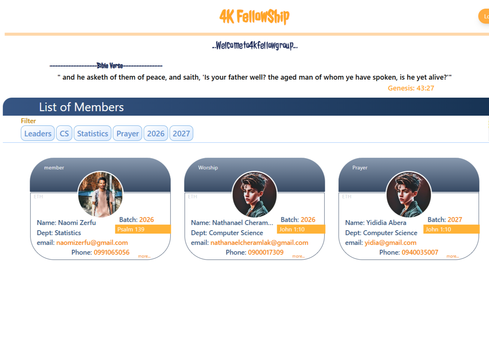
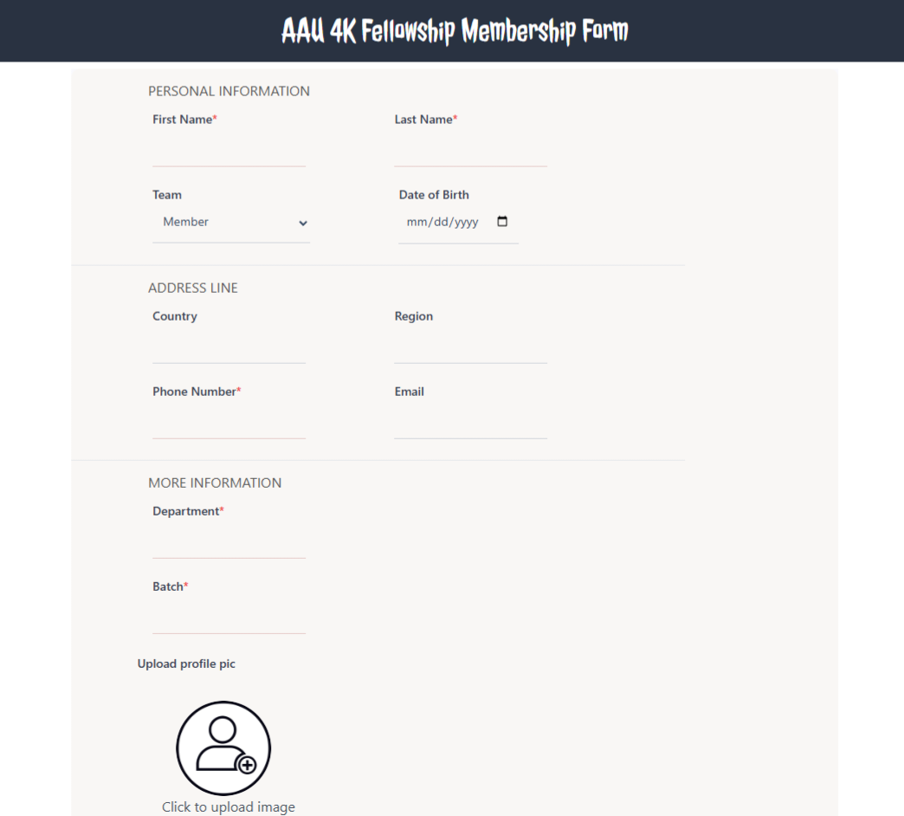
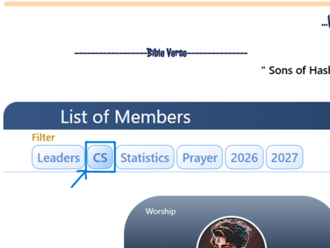

# <a href="https://4k-fellow-naomis-projects-6a2c1253.vercel.app"> 4k Fellow App Link</a>

## Description

Users can become members by providing their personal information through a simple and intuitive form.  
The platform allows team members to view, filter, and manage member data efficiently, enhancing collaboration and accessibility within the fellowship.

## Step-by-Step Guide

### Step 1: View Existing Members

Users can observe a list of current 4K Fellowship members.

### Step 2: Register as a Member

Anyone interested can fill out the membership form by entering personal details.

  

### Step 3: Filter Members

The admin or team can filter members based on specific criteria.  
For example, the view can be filtered to only show Computer Science students (CS).

  
  

